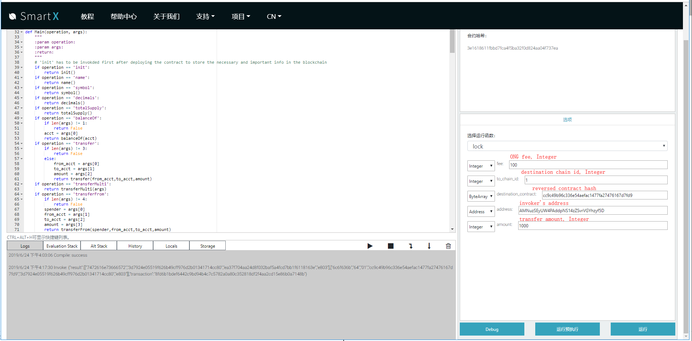

<h1 align="center">跨链使用教程 </h1>

中文 | [English](Tutorial_Case.md)

## 测试网环境

本体多链测试网体系包含一条主链和两条侧链，主链和侧链，侧链和侧链之间可以完成跨链业务

|               | 主链         | 侧链         | 侧链         |
| ------------- | ------------ | ------------ | ------------ |
| **ip**        | 172.168.3.73 | 172.168.3.74 | 172.168.3.75 |
| **rest port** | 20334        | 20334        | 20334        |
| **ws port**   | 20335        | 20335        | 20335        |
| **rpc port**  | 20336        | 20336        | 20336        |
| **chain ID**  | 0            | 1            | 2            |


<br/>
<br/>
<br/>

## 资产转移，前往下载 [multichain-transfer ](https://github.com/siovanus/multichain-transfer)资产转移工具

[multichain-transfer ](https://github.com/siovanus/multichain-transfer)是资产转移工具，在正式使用之前，我们先了解相关的配置和使用帮助

<br/>

### 配置文件和使用帮助

配置文件 `config.json` 文件如下：

```json
{
  "ChainID": 0,
  "JsonRpcAddress":"http://172.168.3.73:20336",
  "GasPrice":500,
  "GasLimit":20000
}
```

- `ChainID`  是当前所处链的 ID

- `JsonRpcAddress` 是当前所处链的 `ip` 地址和 `rpc` 端口

  

可以通过在命令行执行 `./main -h` 查看帮助


- `--fee` 表示矿工费
- `--chain-id` 表示目标链的链ID
- `--amoun`t 表示要转移 `ONG` 的数量（精度为9）
- `--wallet` 后面需要指定 `wallet.dat` 文件的路径，默认为当前路径

<br/>
<br/>

### 工具使用

首先确定我们当前处于主链还是侧链，即 `config.json` 文件中的配置


<br/>

运行命令行，执行：`./main --fee 10000000000 --chain-id 1 --amount 150000000000`，并且输入密码


<br/>

`config.json ` 当中指定了我们当前处于主链，当使用资产转移工具执行跨链交易时，指定了 `--chain-id 1`  , `--fee 10000000000` , `--amount 150000000000` ，即向id为1的侧链转账150个 `ONG`，并扣除当前所处主链的费用 10个`ONG`

<br/>

<br/>

### 校验到账

我们可以在  `Cyano`  钱包上，查看余额是否到账，在此之前，我们在  `Cyano`  先导入上述用到的 `wallet.dat` 文件，确保是同一个，同时确保处于我们所想查看的网络上

例如，我们刚刚在主链，向侧链转账了。查看刚刚的侧链 id 为1，资产是否到账，我们可以通过更改 `Net` 和`Private node ip/address`。由于侧链 `id` 为 1 的 `ip` 为`138.91.6.193`，因此我们在 `Cyano` 中更改即可


<br/>
更改之后，我们可以查看到，刚刚所转账的 `ONG` 已经到账


<br/>

若想主链向其他侧链，或侧链向主链转账，同理。但需要主要的是，侧链和侧链直接转账不可行，`ONG` 必须经过主链。因此，若想侧链向侧链，需要先将侧链 `ONG` 转移至主链，再将转移到主链的 `ONG` 转移至新的侧链

<br/>
<br/>
<br/>

### 跨链合约使用，前往下载[OEP4合约模板](https://github.com/siovanus/multiChainContract/tree/master/OEP4-template)

我们可以使用 [samrtx](https://smartx.ont.io) 部署和运行智能合约

<br/>

#### 部署智能合约并初始化

部署智能合约A到主链 `id` 0 上，我们先确保 `Cyano` 处于主链网络上，即更改 `Net` 和 `Private node ip/address`

合约文件中，`owner` 为智能合约的管理人，我们更改为自己需要设置的 `owner` 地址即可


<br/>

部署完成之后，调用 `init` 方法，初始化10亿 `token` 给 `owner` 地址


<br/>

部署智能合约 `B` 到侧链`id` 1上，智能合约 `C` 到侧链 `id` 2上，同上原理，更换 `Cyano` 为侧链 `ip`，在 `smartx` 上部署。部署完成后也需要执行 `init`，但是初始化10亿 `token` 是给该智能合约的地址
<br/>
<br/>
<br/>

#### 运行合约

**1. 调用合约的lock函数进行跨链转账**
<br/>
在此之前，若是主链往侧链转账需注意， `Cyano` 需处于主链网络上，`lock`函数中，指定 `to chain_id` 为侧链 `id`
<br/>
在一切准备就绪后，接下来，我们执行 lock 函数


<br/>

其中 `destination_contract` 是为需要转账到对方合约的反序后的 `hash` 值，可以使用 `smartx` 上的反序工具进行反序


点击运行之后，会调用 `Cyano `进行签名。执行成功后，可以在 `smartx` 左侧的 `Logs` 中查看到结果和交易 `hash`
<br/>
<br/>

**2. 验证侧链是否到账**
在此之前，我们需要在 `Cyano` 上添加 `OEP4 Token` 的地址，此地址即为 `B` 合约部署在侧链的合约地址


<br/>


之后，需要切换 `Cyano` 网络到侧链上，例如，我们刚刚向侧链 `id` 为 1 的转账，则应该在 `Cyano` 中切换为对应的侧链 `id` 为 1 的网络


<br/>

可以查看到已经到账的 `OEP4 token`


<br/>


当侧链向主链转账，侧链向侧链转账，只要确保转账的地址中存在 `OEP4` 的资产即可，原理同上
